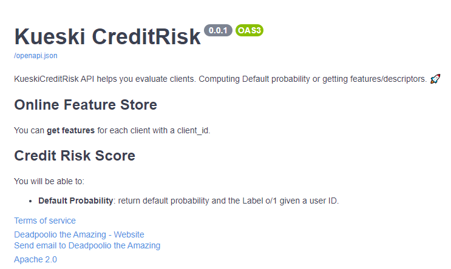
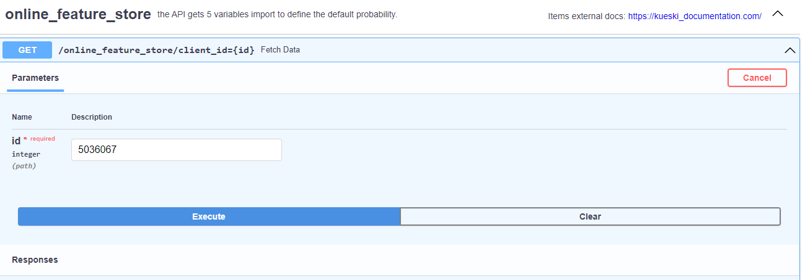
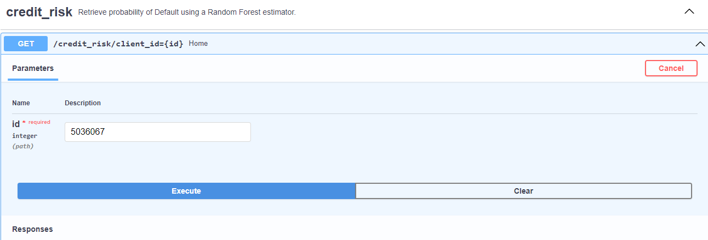
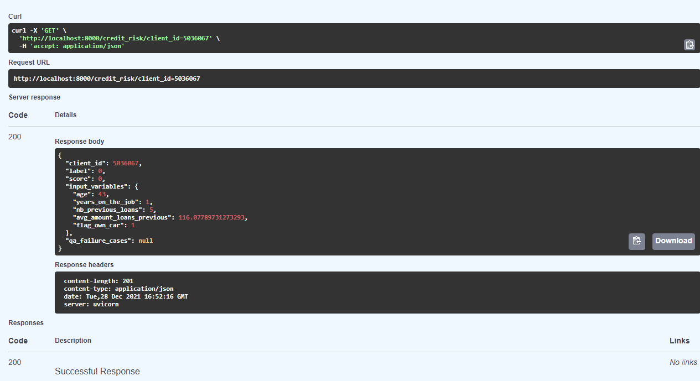

 
    

# MLE_Challenge
Brief challenge to measure API and pipeline deployment as a Machine Learning Engineer

* The functional / technical specifications of the document ("./challenge/Machine_Learning_Engineer_Technical_Challenge_Kueski.docx")
        were followed for the implementation of the API.

### API Dev
Among the functional requirements is the creation/development of two APIs.
* (1) creating an API to serve  features for each client
* (2) creating a prediction service that uses the created features.

Documentation is available at local host on **http://127.0.0.1:8000/docs**.

                 

#### 4.3. Create an API to serve the features **http://127.0.0.1:8000/online_feature_store/client_id={id}** 

A local API was developed as a Demo using FastAPI. The API interacts with a SQL database (this could be change in a real scenario to a SQL or NoSQL database as Aurora or DynamoDB) and serve the features as a json. 

Some aspects that were taken into account that should be important to highlight:

* Check if the user exists on database.
* Architecture is compatible with a service with a subsecond time response.

                 

In the real world, I would choose a storage infrastructure known as an "online" feature store, that presents a low latency appropriate for a service that should respond in milliseconds. For this reason, I prefer SQL or Dynamodb databases and it would avoid store features on parquet and avro files.

##### 4.4. Create an API to make predictions  **http://127.0.0.1:8000/credit_risk/client_id={id}**
To develop the second API also was used FastAPI. This API gets the features from the first API and returns each feature given a user/client id, the probability/score of "Credit Risk Default" and the associated label.

                 
You can test direct on docs web page:

                 

The important aspects to pointing out could be:

* QA over each characteristic building a pydantic model to be sure about the data type and the imputation of each variable.
